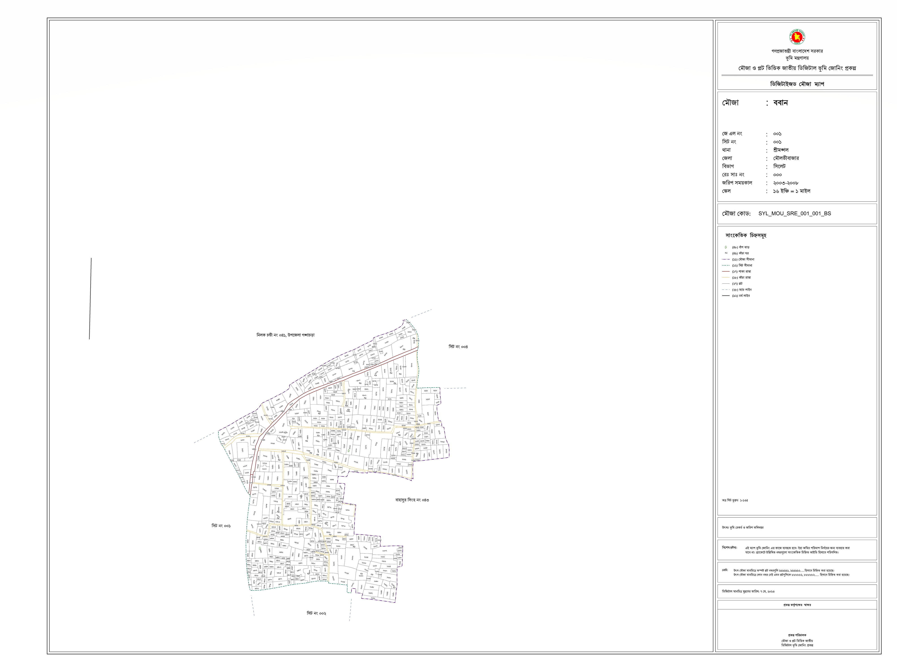
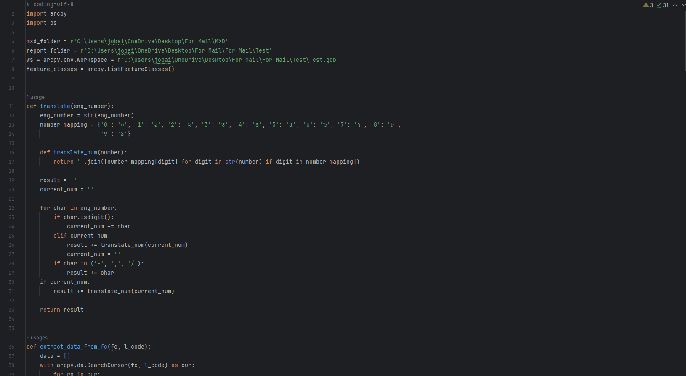
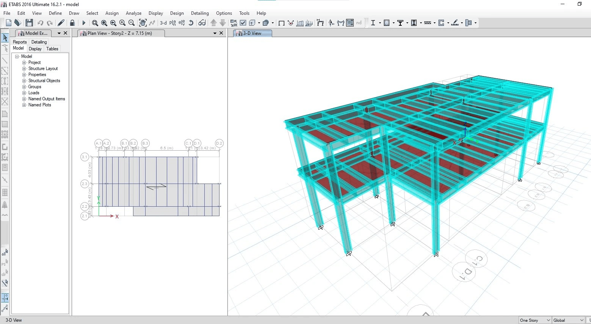
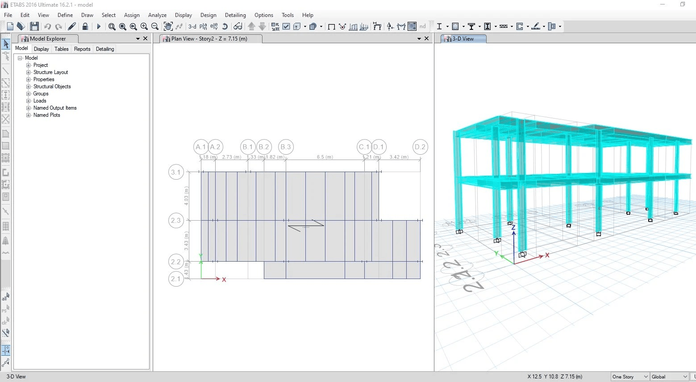

Mauza and Plot Based National Digital Land Zoning Project

Here if I have been given a geodatabase of the area/place/object of my hometown Rangpur, Bangladesh to be mapped, I was given the task to automatically generate maps in accordance with the client's desired format. Using python coding the map can be printed in various formats, like jpg, png, tiff, pdf, mxd, and so on.

Design and analysis of diverse steel and concrete structural framework

Use ETABS and SAP2000

<iframe src="[https://player.vimeo.com/video/123456789](https://www.loom.com/share/e43bee65b1404158816a519bedd2dbf8?t=28&sid=02a711cf-0734-4885-93e8-e70a80da5914)" width="640" height="360" frameborder="0" allow="autoplay; fullscreen" allowfullscreen></iframe>

